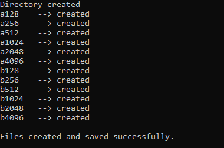
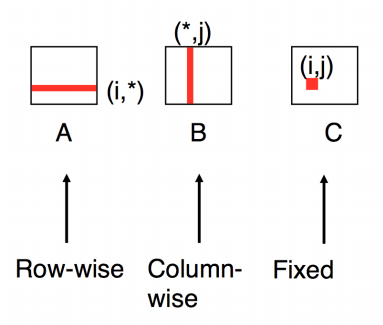
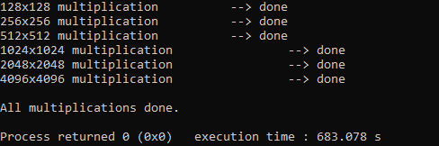
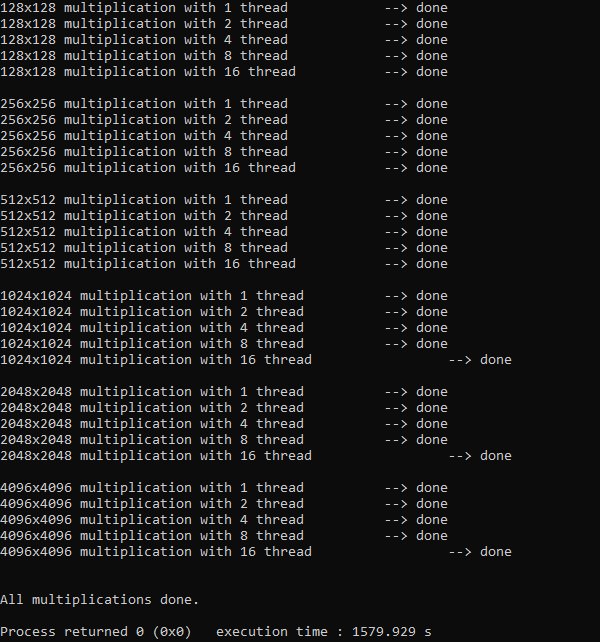
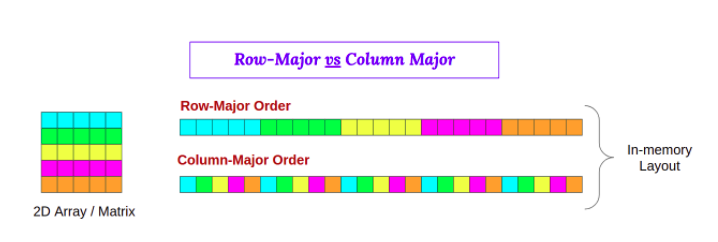
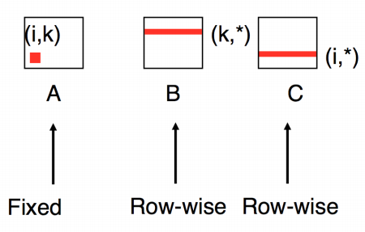
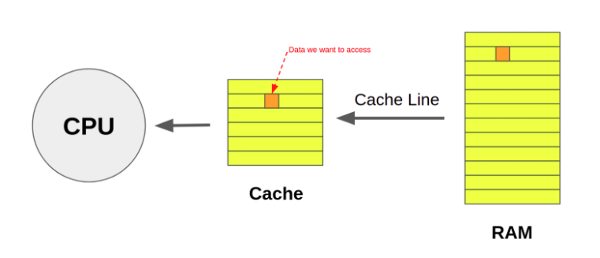
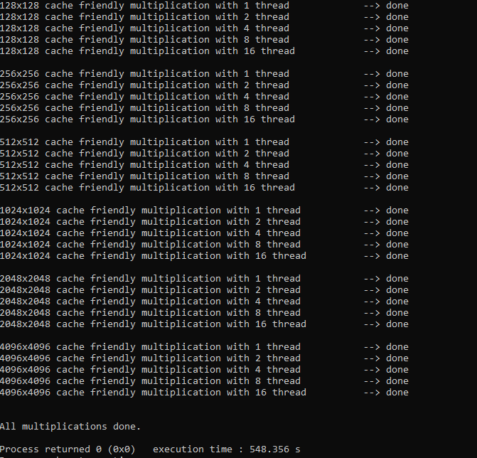

# Parallel Dense Matrix Multiplication

This report is about the matrix multiplication methods and their differences. At the end of the report, there are compares of these methods from a time aspect. This report is divided into 3 parts:

- [Matrix Multiplication with **traditional serial method**](#1-matrix-multiplication-with-traditional-serial-method)
  - for matrix size: 128, 256, 512, 1024, 2048, and 4096
- [**Multithreaded** Matrix Multiplication](#2-multithreaded-matrix-multiplication)
  - for thread size: 1, 2, 4, 8, and 16
  - for matrix size: 128, 256, 512, 1024, 2048, and 4096
- [**Cache Friendly Multithreaded** Matrix Multiplication](#3-cache-friendly-multithreaded-matrix-multiplication)
  - for thread size: 1, 2, 4, 8, and 16
  - for matrix size: 128, 256, 512, 1024, 2048, and 4096
- [**BONUS**: How to run these codes?](#bonus-how-to-run-these-codes-these-instructions-are-for-ubuntu-os)

</br>

Before all parts, let’s start with the simple program that generates matrix files for us. **_write_file.c_** is a C program that creates a folder called data if it doesn’t exist and fill this folder with .txt files which represent 2 different random generated matrices. These matrices have **_128, 256, 512, 1024, 2048, and 4096 versions_**. The numbers in them, are randomly selected between 0-10. When this program runs, results will be like this:

<p align="center">
  
</p>

Now, our different version matrices are ready. It is time to start Matrix Multiplication methods. All methods generate **_.txt_** files that represent multiplication results. At the end of the file, there is time information about them(total time of multiplication, writing to file and etc). Let`s start with the Traditional Serial Matrix Multiplication method.

---

## 1. Matrix Multiplication with traditional serial method

In the traditional serial method, the first matrix will be read from memory in row-wise order and the second matrix will be read from memory in column-wise order. This is classical matrix multiplication:

<p align="center">
  
</p>

The program takes the matrices in all sizes and calculates multiplications of them. When this program runs, results will be like this:

<p align="center">
  
</p>

---

## 2. Multithreaded Matrix Multiplication

In this method, the program will still use the traditional multiplication method but in extra, it will use the threads to operate multiplications at the same time on multiple threads which is called Multithreaded operation. In this section, the program will run the same **_.txt_** files for **_1, 2, 4, 8, and 16 threads_**. When the program will run, results will be like this:

<p align="center">
  
</p>

---

## 3. Cache Friendly Multithreaded Matrix Multiplication

This method is not using the traditional serial method. Cache Friendly Multithreaded Matrix Multiplication method is more complicated for humans but more efficient for computers.

**_C is a row-major language_**. That means it reaches out the data in row order. If a program needs the whole data in one column, it has to reach all row data(include useless ones) and take the data from it. Then the program will do a lot of cache miss because it can not store whole data in cache. It needs to go to memory to get specific data. The developer has to decrease the cache miss ratio to increase the performance of the program.

<p align="center">
  
</p>

For these matrices, for accessing row data, cache miss almost decreases to **_25%_**. But in column accesses cache miss is near to **_100%_**. That means it gets the specific data always from the main memory instead of the cache. When we compare, it takes more time than normal cache access. In this method, there is not any column access. With the power of multithreaded operation, the program becomes almost the fastest version of itself.

<p align="center">
  
</p>

As mentioned above, accessing specific data from the **_cache_** is efficient than accessing it from the **_main memory or RAM_**.

<p align="center">
  
</p>

When the program will run, results will be like this:

<p align="center">
  
</p>

---

> In the traditional serial method, the multiplication of 4096 x 4096 matrices, takes 610 seconds (10 minutes). But with using 16 threads and a cache friendly algorithm, it decreases to 30 seconds (0.5 minutes). It is almost 20 times faster than the traditional one. Then, we can say that the most important point in multiplication is how the developer wrote it. The results are identically same but efficient one uses the resources in a better way. That made the multiplication time nearly 20 times faster. Let`s see the whole statistics in tables, that helps us to see more clearly.

The first one will be multiplication time comparison. There are 3 methods mentioned above and will start with traditional method, here is the results:

| Matrix sizes | Traditinal serial method (Multiplication time) |
| :----------: | :--------------------------------------------: |
|  128 x 128   |                 0.008 seconds                  |
|  256 x 256   |                 0.059 seconds                  |
|  512 x 512   |                 0.479 seconds                  |
| 1024 x 1024  |                 5.084 seconds                  |
| 2048 x 2048  |                 63.21 seconds                  |
| 4096 x 4096  |                 610.01 seconds                 |

---

| Matrix sizes - thread size | Parallel(Multiplication time) | Cache friendly parallel(Multiplication time) |
| :------------------------: | :---------------------------: | :------------------------------------------: |
|    128 x 128 – 1 thread    |         0.005 seconds         |                0.007 seconds                 |
|   128 x 128 – 2 threads    |         0.003 seconds         |                0.004 seconds                 |
|   128 x 128 – 4 threads    |         0.002 seconds         |                0.003 seconds                 |
|   128 x 128 – 8 threads    |         0.002 seconds         |                0.003 seconds                 |
|   128 x 128 – 16 threads   |         0.003 seconds         |                0.001 seconds                 |
|    256 x 256 – 1 thread    |         0.052 seconds         |                0.055 seconds                 |
|   256 x 256 – 2 threads    |         0.024 seconds         |                0.028 seconds                 |
|   256 x 256 – 4 threads    |         0.013 seconds         |                0.015 seconds                 |
|   256 x 256 – 8 threads    |         0.013 seconds         |                0.008 seconds                 |
|   256 x 256 – 16 threads   |         0.006 seconds         |                0.009 seconds                 |
|    512 x 512 – 1 thread    |         0.425 seconds         |                0.439 seconds                 |
|   512 x 512 – 2 threads    |         0.231 seconds         |                0.227 seconds                 |
|   512 x 512 – 4 threads    |         0.110 seconds         |                0.120 seconds                 |
|   512 x 512 – 8 threads    |         0.093 seconds         |                0.065 seconds                 |
|   512 x 512 – 16 threads   |         0.061 seconds         |                0.068 seconds                 |
|   1024 x 1024 – 1 thread   |         4.535 seconds         |                3.621 seconds                 |
|  1024 x 1024 – 2 threads   |         2.637 seconds         |                1.818 seconds                 |
|  1024 x 1024 – 4 threads   |         1.342 seconds         |                0.931 seconds                 |
|  1024 x 1024 – 8 threads   |         0.687 seconds         |                0.518 seconds                 |
|  1024 x 1024 – 16 threads  |         0.698 seconds         |                0.540 seconds                 |
|   2048 x 2048 – 1 thread   |         56.92 seconds         |                28.13 seconds                 |
|  2048 x 2048 – 2 threads   |         33.50 seconds         |                14.31 seconds                 |
|  2048 x 2048 – 4 threads   |         17.36 seconds         |                7.384 seconds                 |
|  2048 x 2048 – 8 threads   |         9.918 seconds         |                4.167 seconds                 |
|  2048 x 2048 – 16 threads  |         9.888 seconds         |                4.135 seconds                 |
|   4096 x 4096 – 1 thread   |         665.0 seconds         |                204.3 seconds                 |
|  4096 x 4096 – 2 threads   |         343.7 seconds         |                113.6 seconds                 |
|  4096 x 4096 – 4 threads   |         181.0 seconds         |                57.73 seconds                 |
|  4096 x 4096 – 8 threads   |         107.5 seconds         |                33.82 seconds                 |
|  4096 x 4096 – 16 threads  |         106.3 seconds         |                35.37 seconds                 |

</br>

---

</br>

Let’s see the whole operation time (**_load files + multiplication + create/write files_**)

| Matrix sizes - thread size | Parallel(Total operation time) | Cache friendly parallel(Total operation time) |
| :------------------------: | :----------------------------: | :-------------------------------------------: |
|    128 x 128 – 1 thread    |         0.009 seconds          |                 0.010 seconds                 |
|   128 x 128 – 2 threads    |         0.007 seconds          |                 0.007 seconds                 |
|   128 x 128 – 4 threads    |         0.005 seconds          |                 0.005 seconds                 |
|   128 x 128 – 8 threads    |         0.005 seconds          |                 0.008 seconds                 |
|   128 x 128 – 16 threads   |         0.006 seconds          |                 0.005 seconds                 |
|    256 x 256 – 1 thread    |         0.065 seconds          |                 0.069 seconds                 |
|   256 x 256 – 2 threads    |         0.038 seconds          |                 0.040 seconds                 |
|   256 x 256 – 4 threads    |         0.025 seconds          |                 0.028 seconds                 |
|   256 x 256 – 8 threads    |         0.025 seconds          |                 0.021 seconds                 |
|   256 x 256 – 16 threads   |         0.019 seconds          |                 0.022 seconds                 |
|    512 x 512 – 1 thread    |         0.472 seconds          |                 0.491 seconds                 |
|   512 x 512 – 2 threads    |         0.280 seconds          |                 0.275 seconds                 |
|   512 x 512 – 4 threads    |         0.158 seconds          |                 0.169 seconds                 |
|   512 x 512 – 8 threads    |         0.141 seconds          |                 0.113 seconds                 |
|   512 x 512 – 16 threads   |         0.111 seconds          |                 0.118 seconds                 |
|   1024 x 1024 – 1 thread   |         4.725 seconds          |                 3.818 seconds                 |
|  1024 x 1024 – 2 threads   |         2.821 seconds          |                 2.012 seconds                 |
|  1024 x 1024 – 4 threads   |         1.512 seconds          |                 1.124 seconds                 |
|  1024 x 1024 – 8 threads   |         0.878 seconds          |                 0.714 seconds                 |
|  1024 x 1024 – 16 threads  |         0.882 seconds          |                 0.743 seconds                 |
|   2048 x 2048 – 1 thread   |         57.53 seconds          |                 28.89 seconds                 |
|  2048 x 2048 – 2 threads   |         34.12 seconds          |                 15.08 seconds                 |
|  2048 x 2048 – 4 threads   |         18.01 seconds          |                 8.033 seconds                 |
|  2048 x 2048 – 8 threads   |         10.66 seconds          |                 4.933 seconds                 |
|  2048 x 2048 – 16 threads  |         10.67 seconds          |                 4.784 seconds                 |
|   4096 x 4096 – 1 thread   |         668.1 seconds          |                 207.0 seconds                 |
|  4096 x 4096 – 2 threads   |         346.5 seconds          |                 116.6 seconds                 |
|  4096 x 4096 – 4 threads   |         184.1 seconds          |                 60.71 seconds                 |
|  4096 x 4096 – 8 threads   |         110.6 seconds          |                 36.98 seconds                 |
|  4096 x 4096 – 16 threads  |         109.1 seconds          |                 38.34 seconds                 |

---

    These operations calculated on the SSD with using:
    CPU: Intel(R) Core(TM) i7-9700K CPU 3.60GHz
    RAM: 16.0 GB

---

### BONUS: How to run these codes? (These instructions are for **_Ubuntu OS_**)

- Creating matrix files

```bash
gcc -o cr_file cr_file.c
./cr_file
```

Now, files are created in the **_/data_** folder.

- Run method 1: Traditional matrix multiplication

```bash
gcc -o trad_m trad_m.c
./trad_m
```

- Run Method 2: Multithreaded Matrix Multiplication

```bash
gcc -o thread_m thread_m.c -lpthread
./thread_m
```

- Run Method 3: Cache Friendly Multithreaded Matrix Multiplication

```bash
gcc -o thread_c_m thread_c_m.c -lpthread
./thread_c_m
```

---

<h3 align="center">
    THANKS FOR READING
</h3>

---
